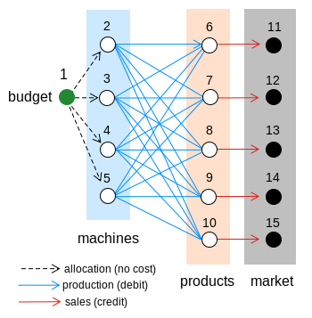

# Problem Set 4 (PS4): Reimagining the Production Problem as a Maximum Flow Problem on a Graph
In this problem set, we will solve a similar problem to the L9c production problem, but now we will structure the calculation as a maximum flow linear programming problem on the bipartite graph:

    

        
    

We are given machines $\left\{m_{i}\right\}_{i=1}^{i=n}$ that produce products $\left\{p_{i}\right\}_{i=1}^{i=m}$. 
Production is constrained by the total number of products (quota) that must be produced $\mathcal{Q} = 100$ (units: `units`), where each machine must make at least $q_i$ product units (sum of all product types). The cost of operating machine $i$ per unit product $j$ produced is $w_{ij}$, the weight of the edge connecting machine $i$ to product $j$ in the bipartite graph. The unit price for product $j$ is $c_j$ (units: `USD/unit`), the weight of the edge connecting product $j$ to its sink (market) node in the bipartite graph. Finally, there is a minimum demand of $r_j\in\mathbf{r}$ units of each product $j$.

The connectivity of the production graph is encoded in the matrix $\mathbf{A}$, where element $a_{ij}$ describes the connection between node $i$ and edge $j$ in the bipartite graph:
* If $a_{ij} = 0$, node $i$ does not connect to edge $j$.
* If $a_{ij} = 1$, the edge $j$ is an incoming edge for node $i$.
* If $a_{ij} = -1$, the edge $j$ is an outgoing edge for node $i$.

## Task: Solve the Primal Problem
Compute an optimum production plan that maximizes the total operating profit (revenue from selling the products minus the production costs) that satisfies the production budget and demand constraints. The data for the primal production problem is given in the table below:

| Machine | $b_{i}$ | p$_{1}$ |  p$_{2}$ | p$_{3}$ | p$_{4}$ | p$_{5}$ |
| :---: | :---: | --- | --- | --- | --- | --- |
m$_{1}$ | 10 | 1.2 | 1.3 | 0.7 | 0.1 | 0.5
m$_{2}$ | 10 | 0.7 | 2.2 | 1.6 | 0.5 | 1.0 |
m$_{3}$ | 10 | 0.9 | 0.7 | 1.3 | 1.0 | 0.8 |
m$_{4}$ | 10 | 1.4 | 2.8 | 0.5 | 1.2 | 0.6 |
Unit price $ | -- | 18 | 25 | 10 | 12 | 15

The minimum demand for each product is given by $\mathbf{r} = [5, 10, 10, 15, 10]$ units. Each machine must produce at least $q_i = 10$ units of products. The production costs are given in the table above. The production budget is $\mathcal{Q} = 100$ units.
1. Update the `data/Bipartite.edgelist` file and the `data/Bipartite.nodecapacity` file (taken from `D9d`) to reflect the production problem structure and parameters.
1. Complete the implementation of the `runme_primal_problem.jl` script to solve the primal problem. The script should create (and populate) a `MyLinearProgrammingProblemModel` instance and pass that model to the `solve` function. The `solve` function computes the optimal production plan. Reminder: we are maximizing the total operating profit, which is the revenue from selling products minus production costs. What does this mean for the objective function coefficients?
1. Execute the `runme_primal_problem.jl` script to solve the primal problem and generate the output files in the `results` folder. To test your implementation, you can compare the output to the expected output in the `results` folder by executing the `testme_primal_problem.jl` script.

### Other scripts in this problem set
There are two other scripts in this problem set (that are called by the `runme_primal_problem.jl` script):
- `problemsetup.jl`: Sets up the problem by loading the files from the `data` folder and creating the necessary data structures for the problem.
- `visualize.jl`: Visualizes the bipartite graph and the optimal production plan. This script saves a figure in the `results` folder.
